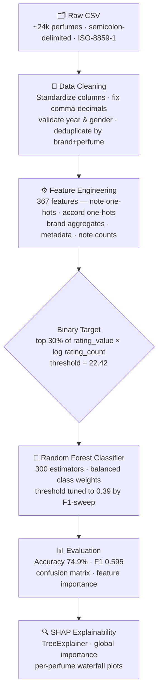

# Olfactory Intelligence

A machine learning project that predicts fragrance success using the Fragrantica dataset.  
Given a perfume's composition (notes, accords, metadata), the model predicts whether it will be a top-30% commercial success.

---

## Project Goals

- Build a binary classification model that predicts perfume success from composition alone
- Understand which fragrance notes and accords most strongly drive success (SHAP explainability)

---

## Dataset

**Source:** Fragrantica web-scraped dataset (`data/raw/fragrantica_raw.csv`)  
**Format:** CSV
**Size:** ~23,846 perfumes after cleaning  
**Key columns:**

| Column | Description |
|---|---|
| `url` | Fragrantica page URL |
| `Perfume` | Perfume name |
| `Brand` | Brand name |
| `Country` | Brand country of origin |
| `Gender` | Target gender (Men / Women / Unisex) |
| `Rating Value` | Average user rating (0–5) |
| `Rating Count` | Number of ratings |
| `Year` | Release year |
| `Top` / `Middle` / `Base` | Fragrance notes (pipe-separated strings) |
| `Perfumer1` / `Perfumer2` | Perfumer names |
| `mainaccord1`–`mainaccord5` | Up to 5 dominant accords |

Download the dataset from [Kaggle — Fragrantica Fragrance Dataset](https://www.kaggle.com/datasets/olgagmiufana1/fragrantica-com-fragrance-dataset) and place the CSV at `data/raw/fragrantica_raw.csv`.
---

## Directory Structure

```
olfactory-intelligence/
├── data/ # All data files (git-ignored)
├── models/
│ └── model_config.json # Best threshold: 0.39
├── notebooks/
│ ├── 01_data_audit.ipynb
│ ├── 02_data_cleaning.ipynb
│ ├── 03_feature_engineering.ipynb
│ ├── 04_modeling.ipynb
│ └── 05_shap_analysis.ipynb
├── reports/
│ ├── figures/ # Confusion matrices, SHAP plots
│ └── results/ # Model comparison CSVs, SHAP outputs
├── src/
│ ├── data/clean_data.py # Cleaning pipeline
│ ├── models/modeling.py # Training, evaluation, threshold tuning
│ └── utils/paths.py # Path constants
├── requirements.txt
└── README.md

```
---

## Pipeline Overview


---

## Setup

```bash
# 1. Clone
git clone https://github.com/sworaj42/olfactory-intelligence.git

cd olfactory-intelligence

# 2. Create virtual environment
python -m venv .venv
.venv\Scripts\activate      # Windows
# source .venv/bin/activate # macOS/Linux

# 3. Install dependencies
pip install -r requirements.txt

# 4. Place the raw data
# Copy fragrantica_raw.csv into data/raw/

# 5. Run notebooks in order
jupyter notebook
```

---

## Model Results

**Task:** Binary classification — top 30% of `rating_value × log(rating_count)` = "successful"  
**Success threshold:** 22.42 (score value)

| Model | Accuracy | Precision | Recall | F1 |
|---|---|---|---|---|
| Composition Only (notes + accords) | 71.7% | 56.4% | 25.6% | 35.3% |
| Full Model (default threshold 0.50) | 74.9% | 61.7% | 43.3% | 50.9% |
| **Full Model (tuned threshold 0.39)** | **70.7%** | **50.8%** | **71.7%** | **59.5%** |

**Feature engineering:** 367 features — one-hot notes, accords, gender, metadata (age, name length, note counts), brand aggregates  
**Algorithm:** Random Forest (300 estimators, balanced class weights, 80/20 train-test split)

---

## Generated Outputs

### Figures (`reports/figures/`)

| File | Description |
|---|---|
| `success_formula_comparison_kde.png` | KDE comparison of two success score definitions |
| `rf_composition_confusion_matrix.png` | Confusion matrix for composition-only model |
| `rf_composition_top25_importance.png` | Top 25 feature importances (composition model) |
| `rf_full_confusion_matrix.png` | Confusion matrix for full model (default threshold) |
| `rf_full_top25_importance.png` | Top 25 feature importances (full model) |
| `rf_full_tuned_confusion_matrix.png` | Confusion matrix for tuned threshold |
| `shap_summary_beeswarm_full_model.png` | SHAP beeswarm — feature impact distribution |
| `shap_summary_bar_full_model.png` | SHAP bar — mean absolute SHAP per feature |
| `shap_dependence_*.png` | SHAP dependence plots for top-3 features |
| `waterfall_*.png` | Per-perfume waterfall explanation |

### Results (`reports/results/`)

| File | Description |
|---|---|
| `model_comparison.csv` | Accuracy / precision / recall / F1 for all 3 models |
| `modeling_artifacts.json` | Feature column lists, train/test indices, thresholds |
| `rf_full_feature_importance.csv` | Gini feature importances for the full model |
| `rf_composition_feature_importance.csv` | Gini feature importances for composition model |
| `test_predictions.csv` | Predicted probabilities on the test set |
| `shap_feature_importance_full_model.csv` | Mean absolute SHAP for all features |
| `shap_top20_features_full_model.csv` | Top 20 SHAP features |
| `shap_report_table_top15.csv` | Ranked top-15 for report writing |
| `shap_prediction_sample_full_model.csv` | Probabilities + labels for the SHAP sample |

---

## Tech Stack

| Library | Purpose |
|---|---|
| pandas, numpy | Data manipulation and feature engineering |
| scikit-learn | Random Forest classifier, metrics, train/test split |
| shap | Model explainability (TreeExplainer) |
| matplotlib | Visualisation — confusion matrices, importance plots, SHAP plots |
| joblib | Model serialisation |
