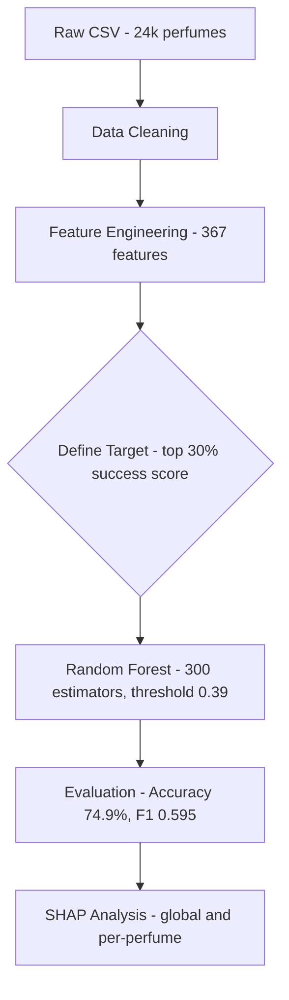
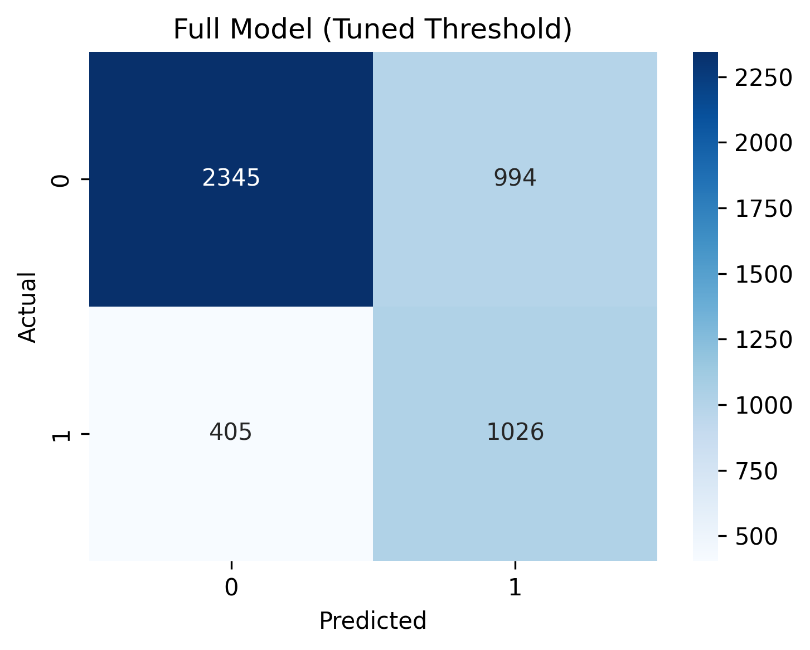
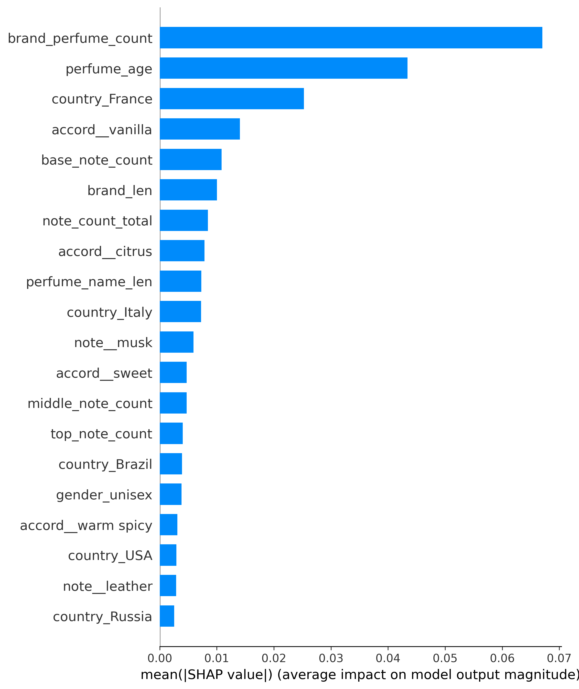
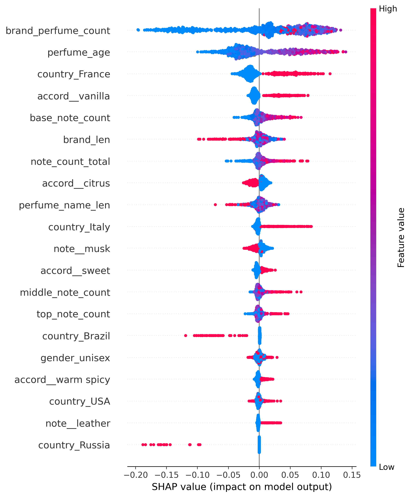
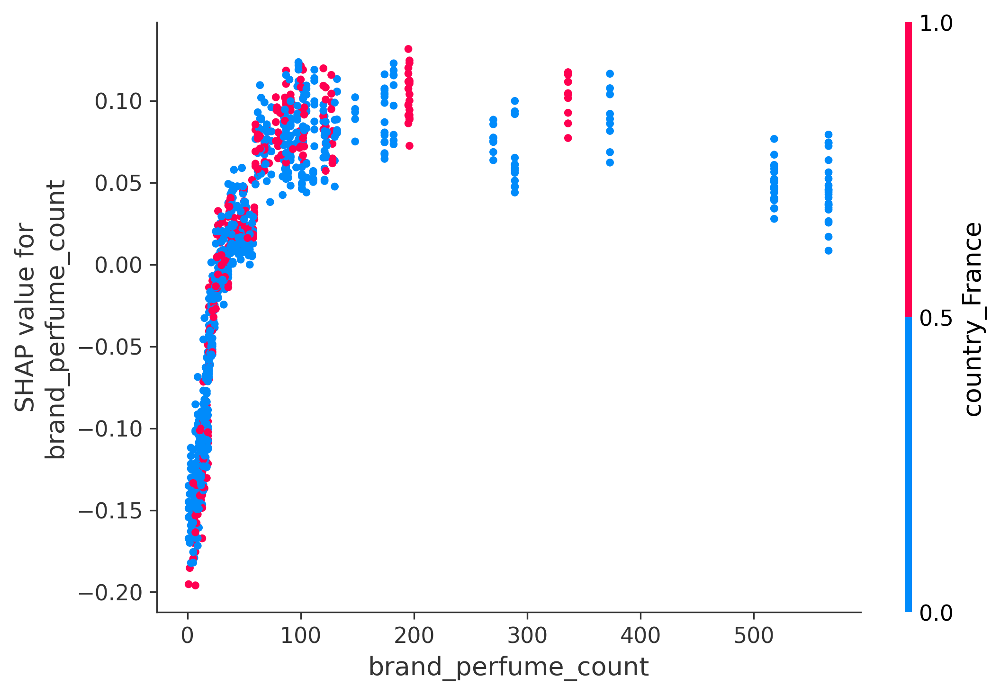
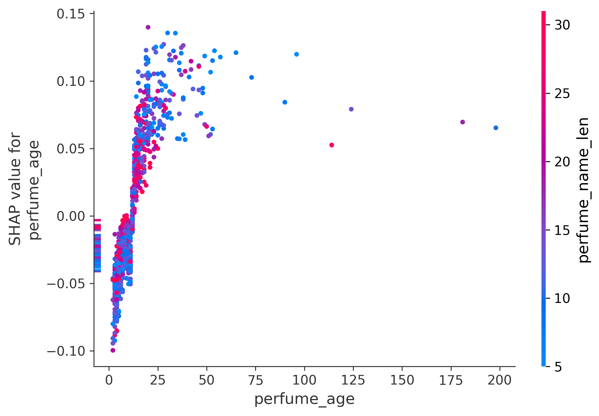
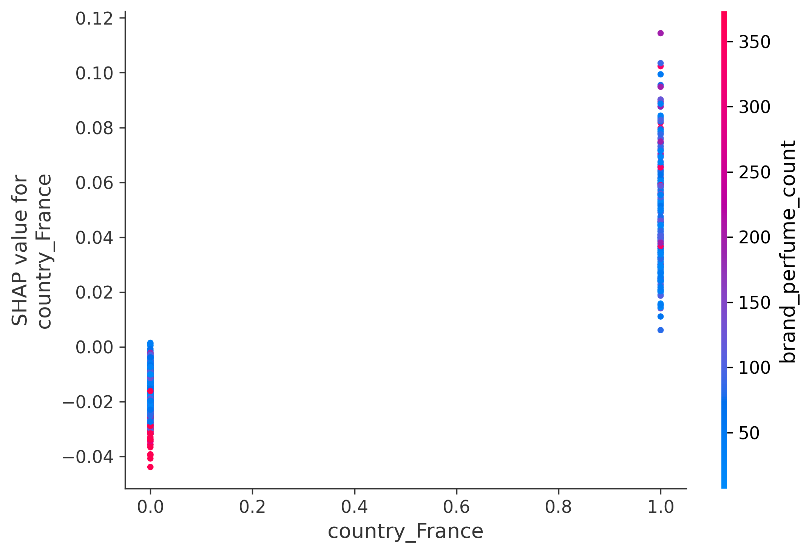
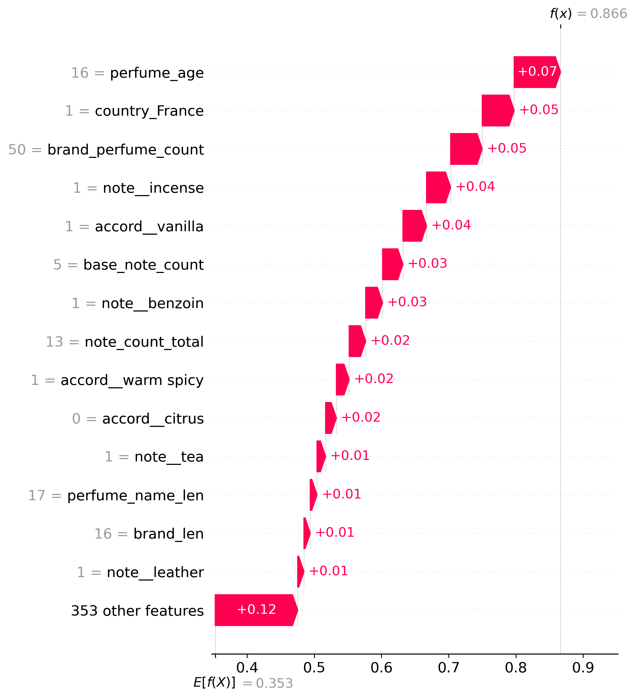

# Olfactory Intelligence

A machine learning project that predicts fragrance success using the Fragrantica dataset.  
Given a perfume's composition (notes, accords, metadata), the model predicts whether it will be a top-30% commercial success.

---

## Project Goals

- Build a binary classification model that predicts perfume success from composition alone
- Understand which fragrance notes and accords most strongly drive success (SHAP explainability)

---

## Dataset

**Source:** Fragrantica web-scraped dataset (`data/raw/fragrantica_raw.csv`)  
**Format:** CSV
**Size:** ~23,846 perfumes after cleaning  
**Key columns:**

| Column | Description |
|---|---|
| `url` | Fragrantica page URL |
| `Perfume` | Perfume name |
| `Brand` | Brand name |
| `Country` | Brand country of origin |
| `Gender` | Target gender (Men / Women / Unisex) |
| `Rating Value` | Average user rating (0–5) |
| `Rating Count` | Number of ratings |
| `Year` | Release year |
| `Top` / `Middle` / `Base` | Fragrance notes |
| `Perfumer1` / `Perfumer2` | Perfumer names |
| `mainaccord1`–`mainaccord5` | Up to 5 dominant accords |


---

## Directory Structure

```
olfactory-intelligence/
├── data/ # All data files (git-ignored)
├── models/
│ └── model_config.json # Best threshold: 0.39
├── notebooks/
│ ├── 01_data_audit.ipynb
│ ├── 02_data_cleaning.ipynb
│ ├── 03_feature_engineering.ipynb
│ ├── 04_modeling.ipynb
│ └── 05_shap_analysis.ipynb
├── reports/
│ ├── figures/ # Confusion matrices, SHAP plots
│ └── results/ # Model comparison CSVs, SHAP outputs
├── src/
│ ├── data/clean_data.py # Cleaning pipeline
│ ├── models/modeling.py # Training, evaluation, threshold tuning
│ └── utils/paths.py # Path constants
├── requirements.txt
└── README.md

```
---

## Pipeline Overview


---

## Setup

```bash
# 1. Clone
git clone https://github.com/sworaj42/olfactory-intelligence.git
cd olfactory-intelligence

# 2. Create virtual environment
python -m venv .venv
.venv\Scripts\activate      # Windows
# source .venv/bin/activate # macOS/Linux

# 3. Install dependencies
pip install -r requirements.txt
pip install pyarrow

# 4. Download the dataset
# https://www.kaggle.com/datasets/olgagmiufana1/fragrantica-com-fragrance-dataset
# Place fragrantica_raw.csv into data/raw/

# 5. Run notebooks in order
jupyter notebook
```

---

## Model Results

**Task:** Binary classification - top 30% of `rating_value × log(rating_count)` = "successful"  
**Success threshold:** 22.42 (score value)

| Model | Accuracy | Precision | Recall | F1 |
|---|---|---|---|---|
| Composition Only (notes + accords) | 71.7% | 56.4% | 25.6% | 35.3% |
| Full Model (default threshold 0.50) | 74.9% | 61.7% | 43.3% | 50.9% |
| **Full Model (tuned threshold 0.39)** | 70.7% | 50.8% | 71.7% | **59.5%** |

**Feature engineering:** 367 features - one-hot notes, accords, gender, metadata (age, name length, note counts), brand aggregates  
**Algorithm:** Random Forest (300 estimators, balanced class weights, 80/20 train-test split)

> **Key Finding:** `brand_perfume_count` and `perfume_age` are the strongest success predictors - outweighing raw scent composition. Market presence matters more than what's in the bottle.




---

## SHAP Analysis

SHAP (SHapley Additive Explanations) explains why the model makes each prediction by attributing a contribution value to every feature.

**Global feature importance - which features matter most across all perfumes:**





**Dependence plots - how each top feature affects predictions:**







**Per-perfume explanation - why "Midnight in Paris" was predicted successful (86.6% probability):**




**Key Findings:**

- **Brand catalogue size dominates** - `brand_perfume_count` is the strongest predictor by far. Brands with larger catalogues consistently produce more successful perfumes, likely due to established distribution and consumer trust.
- **Age beats novelty** - `perfume_age` is the second strongest predictor. Older perfumes have proven longevity; the model learned that staying power is a strong signal of success.
- **French origin adds a premium** - `country_France` has a strong positive SHAP effect. Being from a French brand meaningfully increases predicted success probability.
- **Vanilla and citrus accords help** - `accord__vanilla` and `accord__citrus` show positive SHAP values, suggesting warm and fresh scent profiles are commercially favored.
- **Composition matters less than brand** - the gap between `brand_perfume_count` (0.07) and the first scent-related feature `accord__vanilla` (0.013) is large, confirming that *who made it* outweighs *what's in it*.

---

## Tech Stack

| Library | Purpose |
|---|---|
| pandas, numpy | Data manipulation and feature engineering |
| scikit-learn | Random Forest classifier, metrics, train/test split |
| shap | Model explainability (TreeExplainer) |
| matplotlib | Visualisation - confusion matrices, importance plots, SHAP plots |
| joblib | Model serialisation |

---


## Author

**Swaraj Sigdel** — [GitHub](https://github.com/sworaj42) · [LinkedIn](https://www.linkedin.com/in/swaraj-sigdel-86a6972aa/)